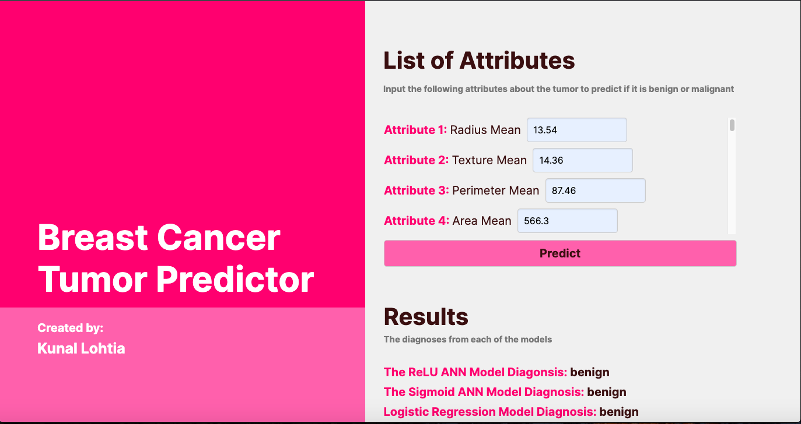

# About this Project

Breast cancer is a prevalent form of cancer that requires accurate classification for effective treatment planning. This project explores various machine learning algorithms to classify tumors as either malignant (cancerous) or benign (non-cancerous) using a comprehensive breast cancer dataset. The dataset comprises 569 instances with 32 attributes per instance, including features like radius, texture, perimeter, area, and various measures of smoothness, compactness, concavity, concave points, symmetry, and fractal dimension. The 'diagnosis' column indicates whether each tumor is benign (B) or malignant (M). Exploratory data analysis using pair plots and heat maps revealed the dataset's characteristics and guided the selection of appropriate modeling techniques. The algorithms under consideration include artificial neural networks (ANN) with ReLU and sigmoid activation functions, along with logistic regression.

Hyperparameter tuning was performed to optimize model performance, including batch size, number of epochs, and learning rate. Data preprocessing involved normalization to ensure uniformity across attributes. The final models were then evaluated based on accuracy and classification reports.


# Development

### Data Preprocessing and Model Training

#### Artificial Neural Network (ANN) with ReLU

- Data Loading and Cleaning:
  - Loads the breast cancer dataset from "breast-cancer.csv".
  - Drops the id column and removes rows where 'concavity_mean' is zero.
  - Splits data into features (X) and target (y).
  - Uses MinMaxScaler to normalize the feature data (X).
  - Converts the target variable (y) into categorical using one-hot encoding (pd.get_dummies).

- Model Training (MLPClassifier):
  - Configures an MLPClassifier with parameters for stochastic gradient descent (solver='sgd'), ReLU activation (activation='relu'), initial learning rate (learning_rate_init=0.2), batch size (batch_size=225), hidden layer sizes (hidden_layer_sizes=(30, 3)), and maximum iterations (max_iter=500).
  - Performs 10-fold cross-validation (cross_validate) with accuracy and mean squared error metrics.

- Model Evaluation:
  - Splits data into training and test sets (train_test_split).
  - Trains the MLPClassifier (mlp.fit).
  - Makes predictions (mlp.predict) and evaluates accuracy (accuracy_score) and mean squared error (mean_squared_error).
  - Prints confusion matrix (multilabel_confusion_matrix) and classification report (classification_report).

- Serialization:
  - Saves the trained model using pickle (pickle.dump(mlp, open("relu.pkl", "wb"))).

#### Artificial Neural Network (ANN) with Sigmoid

- Data Loading and Cleaning:
  - Loads and cleans the breast cancer dataset similarly.

- Model Training (MLPClassifier):
  - Configures an MLPClassifier with parameters for stochastic gradient descent (solver='sgd'), logistic activation (activation='logistic'), initial learning rate (learning_rate_init=0.25), batch size (batch_size=150), hidden layer sizes (hidden_layer_sizes=(30, 10)), and maximum iterations (max_iter=500).
  - Performs 10-fold cross-validation (cross_validate) with accuracy and mean squared error metrics.

- Model Evaluation:
  - Splits data into training and test sets (train_test_split).
  - Trains the MLPClassifier (mlp.fit).
  - Makes predictions (mlp.predict) and evaluates accuracy (accuracy_score) and mean squared error (mean_squared_error).
  - Prints confusion matrix (multilabel_confusion_matrix) and classification report (classification_report).

- Serialization:
  - Saves the trained model using pickle (pickle.dump(mlp, open("annsig.pkl", "wb"))).

#### Logistic Regression

- Data Loading and Cleaning:
  - Similar to relu.py, loads the breast cancer dataset and performs data cleaning.

- Model Training (LogisticRegression):
  - Uses MinMaxScaler to normalize features.
  - Initializes a LogisticRegression model.
  - Trains the model (model.fit), makes predictions (model.predict), and evaluates accuracy (accuracy_score).
  - Prints classification report (classification_report).
  - Serializes the trained model using pickle (pickle.dump(model, open("logistic.pkl", "wb"))).


### Web Application Development

- Flask Application:
  - Creates a Flask web application (Flask(__name__)).
  - Loads the serialized models (pickle.load(open(...)) for 'relu.pkl', 'annsig.pkl', 'logistic.pkl').
  - Initializes MinMaxScaler for feature normalization.
  - Routes:
    - Home Page ("/"):
      - Renders index.html as the home page.

    - Prediction Page ("/predict"):
      - Handles POST requests from a form in index.html.
      - Receives input data from user form.
      - Normalizes the input data using scaler.transform.
      - Uses the loaded models (relu, sigmoid, logistic) to make predictions.
      - Renders index.html with prediction results (prediction_text_relu, prediction_text_sigmoid, prediction_text_logistic).

- Frontend (index.html):
  - HTML Form:
    - Provides an input form for users to enter tumor attributes (Attribute 1 to Attribute 30).
    - Submits data to "/predict" route via POST method.

  - CSS Styling:
    - Uses CSS for styling elements such as text formatting, input boxes, buttons, and layout.
   
# Results

The models achieved highly accurate classifications for breast cancer tumors using advanced machine learning techniques and rigorous model evaluation methods. Key highlights include:

- Accuracy Metrics: Across all models (Artificial Neural Networks with ReLU and Sigmoid activations, and Logistic Regression), they consistently achieved over 98% accuracy in classifying tumors as malignant or benign.

- Precision, Recall, and F1-score: For both malignant and benign tumor classifications, all three models demonstrated exceptional precision, recall, and F1-score metrics that consistently exceeded 95%. 


# How to Run the Program

First make sure the following pkl files have been generated by running the relu.py, annsig.py, and logistic_regression.py files:
```
1. relu.pkl
2. annsig.pkl
3. logistic.pkl
```

From there, run app.py to run the flask web application and to deploy the models

# Test Cases

**Test Case 1 (Tumor 19 in the dataset):** 

It should output Benign for all three models

Input: 13.54, 14.36, 87.46, 566.3, 0.09779, 0.08129, 0.06664, 0.04781, 0.1885, 0.05766, 0.2699, 0.7886, 2.058, 23.56, 0.008462, 0.0146, 0.02387, 0.01315, 0.0198, 0.0023, 15.11, 19.26, 99.7, 711.2, 0.144, 0.1773, 0.239, 0.1288, 0.2977, 0.07259

```
  Example of how to input the data:
  
  Attribute 1: 13.54 
  Attribute 2: 14.36
  .
  .
  .
```


**Test Case 2 (Tumor 0 in the dataset):**

It should output Malignant for all three models

Input: 17.99, 10.38, 122.8, 1001, 0.1184, 0.2776, 0.3001, 0.1471, 0.2419, 0.07871, 1.095, 0.9053, 8.589, 153.4, 0.006399, 0.04904, 0.05373, 0.01587, 0.03003, 0.006193, 25.38, 17.33, 184.6, 2019, 0.1622, 0.6656, 0.7119, 0.2654, 0.4601, 0.1189

```
  Example of how to input the data:
  
  Attribute 1: 17.99 
  Attribute 2: 10.38
  .
  .
  .
```


